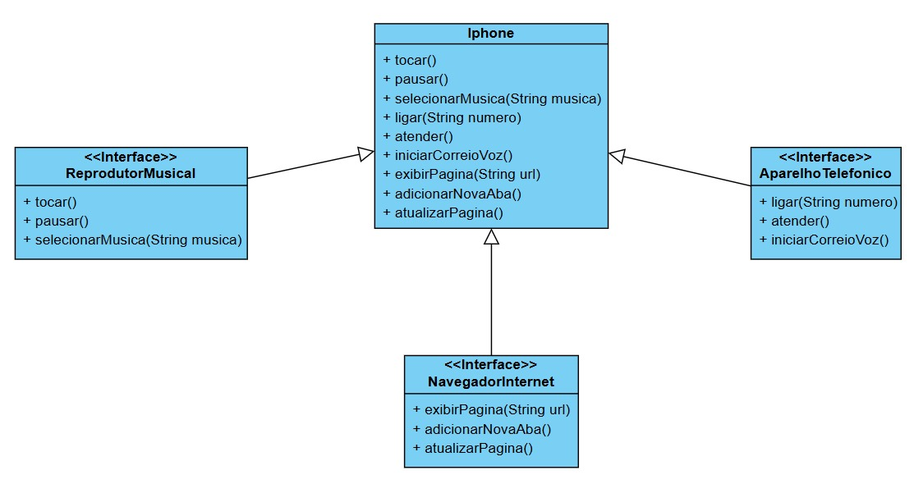

# Desafio iPhone - Digital Innovation One

## 📜 Descrição

Este projeto foi desenvolvido como parte de um desafio do curso de **Java** da **Digital Innovation One**. O objetivo é simular as funcionalidades de um iPhone utilizando os conceitos de **Programação Orientada a Objetos (POO)** e **Interfaces**. O código foi dividido em várias classes para representar diferentes funcionalidades do iPhone, como:

- **Reprodutor Musical**
- **Aparelho Telefônico**
- **Navegador de Internet**

## ⚙️ Funcionalidades

O projeto implementa as seguintes funcionalidades:

### 1. **Reprodutor Musical**
- Tocar música
- Pausar música
- Selecionar música

### 2. **Aparelho Telefônico**
- Realizar chamadas
- Atender chamadas
- Iniciar correio de voz

### 3. **Navegador na Internet**
- Exibir páginas
- Adicionar novas abas
- Atualizar páginas

## 💻 Tecnologias Utilizadas

- **Java**: Linguagem de programação utilizada para o desenvolvimento do projeto.
- **Programação Orientada a Objetos (POO)**: Uso de interfaces e implementação de classes para simular as funcionalidades de um iPhone.

## 📂 Estrutura do Projeto

O código foi organizado em cinco arquivos principais:

1. **Main.java**: Classe responsável por testar todas as funcionalidades do iPhone.
2. **Iphone.java**: Implementação das interfaces `ReprodutorMusical`, `AparelhoTelefonico`, e `NavegadorInternet`.
3. **ReprodutorMusical.java**: Interface que define os métodos relacionados ao reprodutor musical.
4. **AparelhoTelefonico.java**: Interface que define os métodos relacionados ao aparelho telefônico.
5. **NavegadorInternet.java**: Interface que define os métodos relacionados ao navegador de internet.

## 🧩 Diagrama de Classes UML

Abaixo está o diagrama de classes que representa a estrutura do projeto:



## 🚀 Como Rodar o Projeto

Para rodar o projeto, siga os passos abaixo:

### 1. Clone o repositório:
```bash
git clone https://github.com/seuusuario/seu-repositorio.git